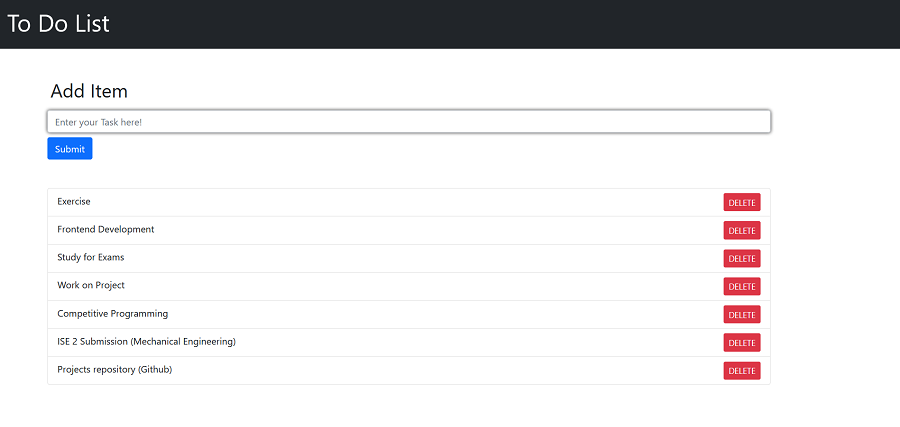
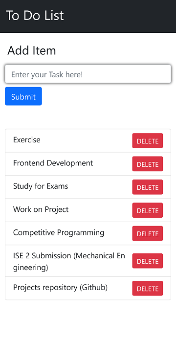

# Todo List

[Todo List Application](https://jiganesh-todolist.herokuapp.com/)

This Todo List is based on Django which is open-source framework used for rapid Web-Development. The Project was built to understand workflow of Application Development and Deployment.

Heroku is the platform which I used to Host the Web Application on. I did not find any suitable tutorial which explained the whole creation and deployment of application, so I built and tried to explain whole process as much as I can.
<hr>

## About-Project

Technologies Used :
Django
HTML
CSS
Heroku

Django is mostly used for CRUD Web Application so I made Todo list which can be very basic application of it.

## Desktop View


<br>
## Mobile View 




Let's Setup first and check if everything we want we have it or not, To check Django is there in your system or not:

```sh
python -m django --version
```

Make a folder which will contain the django project in it
To create virtual environment and activate it
```sh

virtualenv env\
.\env\Scripts\activate
```

To check create a project :

```sh
django-admin startproject [ProjectName]
```

The Development Server:

```sh
python manage.py runserver
```

To create app :

```sh
python manage.py startapp [AppName]
```

Now create first view in apps -> views.py

```python
from django.http import HttpResponse
def index(request):
    return HttpResponse("Hello, world. You're at the index.")
```

To call the view, we need to map it to a URL and for this we need URLconf
To create a URLconf in the polls directory, create a file called urls. py

In apps -> urls. py
```python
from django.urls import path
from . import views

urlpatterns = [
    path('', views.index, name='index'),
]
```

The next step is to point the root URLconf at the polls.urls module. In mysite/urls.py, add an import for django.urls.include and insert an include() in the urlpatterns list, so you have:

```python

from django.contrib import admin
from django.urls import include, path

urlpatterns = [
    path('[appname]/', include('[appname].urls')),
    path('admin/', admin.site.urls),
]
```

Now you can see your view
```
manage.py migrate  #first migrate
manage.py runserver
```
<br>

# TODO List app

Creating Models
For the current application we build a todo list so we need a model to store our data in it.

so open main -> models.py

```python
from django.db import models
# Create your models here.

class Todo(models.Model):
    added_date = models.DateTimeField()
    text = models.CharField(max_length=200)

```
Now this creates model and store it in sqlite

Acitivating Models
To include the app in our project, we need to add a reference to its configuration class in the INSTALLED_APPS setting 

It should be like this 
[folder].apps[camelcase]Config

In our Case todolist -> setting.py INSTALLED_APPS will look like
```python

INSTALLED_APPS = [
    'main.apps.MainConfig',
    'django.contrib.admin',
    'django.contrib.auth',
    'django.contrib.contenttypes',
    'django.contrib.sessions',
    'django.contrib.messages',
    'django.contrib.staticfiles',
]

```

Now Django can include our app so lets make migrations

In terminal
```
python manage.py makemigrations main
python manage.py migrate
```

There’s a command that will run the migrations for you and manage your database schema automatically - that’s called migrate, and we’ll come to it in a moment - but first, let’s see what SQL that migration would run. The sqlmigrate command takes migration names and returns their SQL:

Lets work on our looks now

so now we have to render our html hence we change our views to this 

```python
from django.shortcuts import render
def index(request):
    return render(request, 'main/index.html')

```

Make templates in main add folder in templates named main so hierarchhy would look like this

main -> templates -> main -> index.html

todolist -> <text>urls.py</text>

```python
from django.contrib import admin
from django.urls import include, path

urlpatterns = [
    path('', include('main.urls')), 
    # so  '' keeping it empty so you will directly render index.html
    # instead of doing 127.0.0.1:8000 / [whatever that was in '']
    path('admin/', admin.site.urls),
]
```

What we did here was added the url for our project and now we need to give urls in our project so make urls .py in [appname] folder in our case which is main and with that we can set up our urls and what will they do:

```python
from django.urls import path

from . import views

urlpatterns = [
    path('', views.index, name='index'),
    path('add_todo', views.add_todo, name="add_todo"),
    path('delete_todo/<int:todo_id>/',views.delete_todo,name ="delete_todo")
]
```
Above is the final version of urls python file

This is the Final Logic in views.py 

```python
from django.shortcuts import render
from django.http import HttpResponse,HttpResponseRedirect
from django.utils import timezone #to record current-time
from .models import Todo

# Create your views here.

def index(request):
    todo_items =Todo.objects.all().order_by("added_date")
    return render(request, 'main/index.html',{"todo_items": todo_items})


def add_todo(request):

    content_to_add= request.POST['content']  #get from form with name content
    if content_to_add.replace(" ","") != "":
        current_date = timezone.now() #to get time
        created_obj = Todo.objects.create(added_date=current_date, text=content_to_add)
    return HttpResponseRedirect("/")

def delete_todo(request,todo_id):
    try:
        if Todo.objects.all().count() >0:
            Todo.objects.get(id=todo_id).delete()
        return HttpResponseRedirect("/")
    except:
        return HttpResponseRedirect("/")
```
Now lets add some HTML and CSS so that it looks good

So I will be using BOOTSTRAP here to keep thing simple and clean so lets add bootstrap links and all to our HTMl file.
<br>
<br>


# Heruko Deployment

Signup for heroku >> get git and heroku CLI on your system.

To work with Heroku CLI Open your terminal with the Project and follow the steps.

- Login to your Heroku account
- Initialize a git repository
- Add the changes
- Commit the changes with a message for reference
- Create your app with unique name so that you will get unique url
- git remote:  git remote add just creates an entry in your git config that specifies a name for a particular 
- Now we have to check locally once so we need a server hence u can use waitress as it works on linux and windows server you can check with pip freeze
- change ALLOWED_HOST from project -> settings. py to ["*"]
- Run locally with waitress
- Create "Procfile" in same directory as manage. py
- Edit Procfile so that we can use it with waitress to run locally
- Now you can run it with heroku local
- change ALLOWED_HOST = [projectpath,'localhost']
- you will get the project path from heroku > dashboard > app> setting
- will look like this "jiganesh-todolist.herokuapp.com"
- change SECRET_KEY with Config Vars
- set SECRET_KEY = os.environ['Variable that you used']
- set DEBUG to False
- STATIC_ROOT = BASE_DIR / "static"
- now we have to install whitenoise to load static files to load automatically with heroku
- add whitenoise middleware below security middleware in MIDDLEWARE variable in settings. py 
- change procfile
- collectstatic to get your staticfiles in one place
- check Profile-declare type
- push to heroku
- open the heroku.com link
- and Voila ! Your application will be live.

```sh
heroku login 
git init 
git add .
git commit -m "initial commit"
heroku create jiganesh-todolist 
```
Upto this point you have heruko setup and now we can work and setting up our project live
```sh 
heroku git:remote -a jiganesh-todolist
pip install waitress
waitress-serve --host= 127.0.0.1 --port=8000 [project].wsgi.application
web: waitress-serve --host=127.0.0.1 --port=8000 [project].wsgi.application
pip install whitenoise
'whitenoise.middleware.WhiteNoiseMiddleware'
web: waitress-serve --port=$PORT [project].wsgi.application
manage.py collectstatic
```
All the configuraration will be done by now and we can now commit and push everything

```sh
pip freeze
pip freeze > requirements.txt
git add .
git commit -m "just commited all changes"
git push heroku master
```

To checkout this application : [Visit here](https://jiganesh-todolist.herokuapp.com/)

